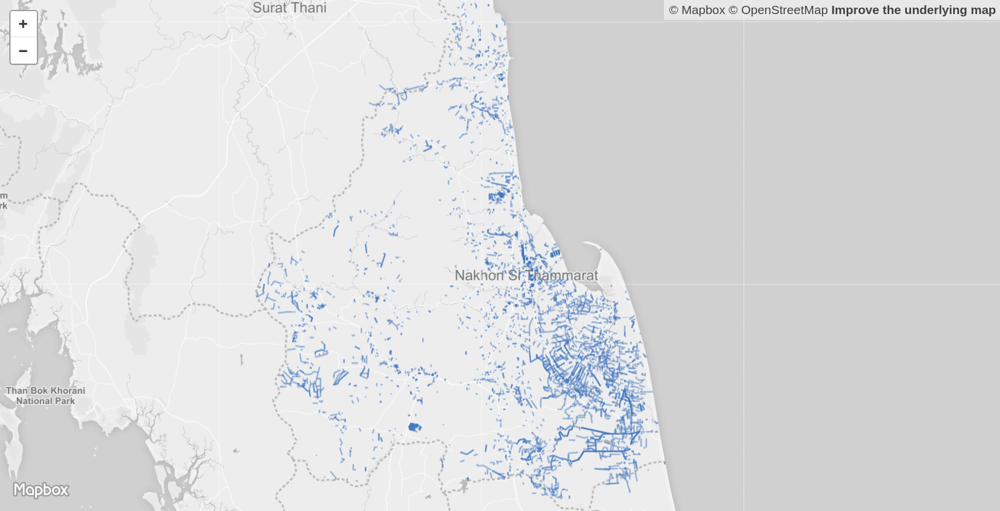

# Dengue Mobile4D

## Features
### Client-side
1. User: Json request with lat & lng
2. Receive jobs
3. Take & send photos
### Server-side
1. Find nearest points
2. Send missing streets
3. Run detection model / store to DB / update missing streets

## Missing Streets
Overall missing-streets in Nakhon-si-thammarat province

Left (an available of Google street view images), Right (linestrings of the missing streets)


## How to run

* Python Installation
```
pip3 install -r requirements.txt
```

* Initialize server
```
python3 index.py
```
### Test request
```
curl -H "Content-Type: application/json" -X POST -d '{"send":"okay"}' http://localhost:5000/foo 
```

## API Reference

### 1. Request missing streets
* Sample JSON request - Send current location of the users
* 
```
curl -H "Content-Type: application/json" \
-X POST \
-d '{
  "type": "Feature",
  "geometry": {
    "type": "Point",
    "coordinates": [100.135, 8.351]
  },
  "properties": {
	"province": "Nakhon Si Thammarat",
	"district": "Pak Phanang",
	"subdistrict": "Khlong Krabue",
	"radius": 1000
  }
}' \
 http://localhost:5000/get/jobs/
```

### 2. Receive jobs


```json
{
  "status": "success",
  "message": ""
}
```

```json
{
	"status": "error",
	"message": "No missing streets found"
}
```
### 3. Submit photos
* Sample JSON request (sending images to the server)
```json
curl \
-F "file=@/home/poom/Pictures/1.jpg" \
-F "file=@/home/poom/Pictures/2.jpg"\
 localhost:5000/upload/images/

```

* Sample JSON respond from the server
```json
{
  "status": "success",
  "message": "The images have been uploaded."
}

```


* Sample output on the server
```
ImmutableMultiDict([('file', <FileStorage: '1.jpg' ('image/jpeg')>), ('file', <FileStorage: '2.jpg' ('image/jpeg')>)])

Accept incoming file: 1.jpg
Save it to: static/uploads/7901bcd5-2d5a-4e2e-9e48-de89c4d18e28/1.jpg

Accept incoming file: 2.jpg
Save it to: static/uploads/7901bcd5-2d5a-4e2e-9e48-de89c4d18e28/2.jpg

127.0.0.1 - - [27/Jun/2018 00:04:49] "POST /upload/images/ HTTP/1.1" 200 -

```


